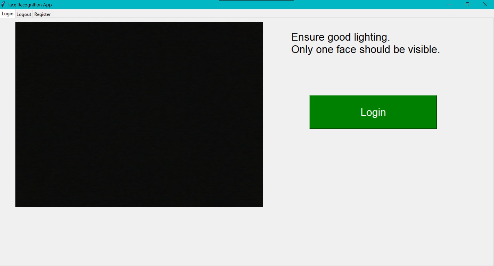
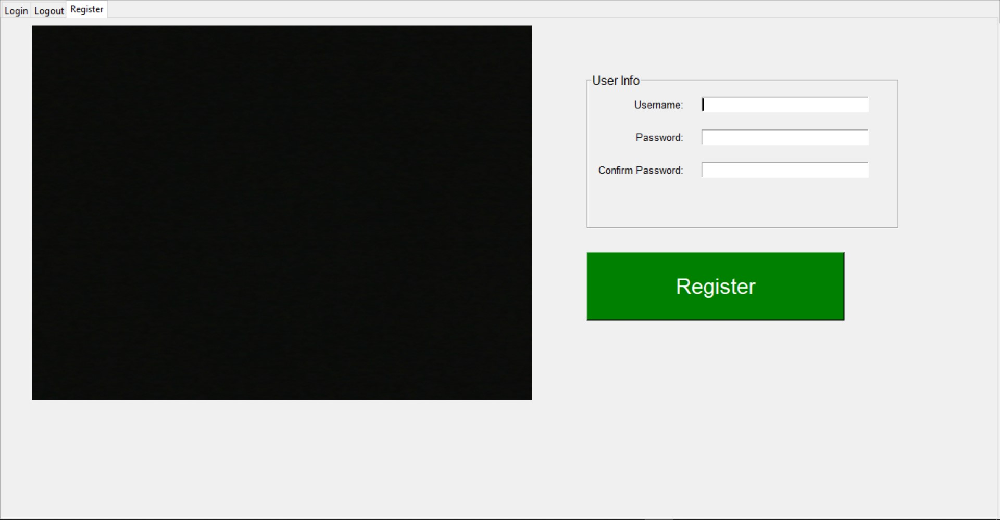

# Face-Recognition-Login-System
A Python-based desktop application using OpenCV, dlib, and face_recognition for secure user login/logout and registration. Includes real-time webcam processing, facial recognition, liveness detection via eye aspect ratio (blink detection), and password verification. Built with Tkinter for a simple tabbed GUI.

## 🧠 Face Recognition Login System with Liveness Detection

This project is a desktop-based facial recognition authentication system developed using Python. It supports real-time face detection, blink-based liveness detection, and password verification to provide a secure, two-factor authentication experience. The graphical user interface (GUI) is built using Tkinter and designed with multiple tabs: Login, Register, and Logout. The Logout tab remains hidden until a successful login is completed.

## 🚀 Features

- 🔐 **Face Recognition Login**
- 👁️ **Blink-Based Liveness Detection** to prevent spoofing
- 🔑 **Two-Factor Authentication**: Face + Password
- 🧾 **User Registration** with facial embedding and credentials
- 🗂️ **Tabbed GUI Interface** (Login, Register, and Logout tabs)
- 📄 **Event Logging** for login and logout timestamps

## 🛠️ Technologies Used

- **Python 3.x**
- **OpenCV** - for real-time video processing
- **Dlib** - for face detection and 68-point facial landmark prediction
- **face_recognition** - for facial embedding and recognition
- **Tkinter** - for building the GUI
- **NumPy** and **SciPy** - for numerical operations and eye aspect ratio calculation
- **Pillow (PIL)** - for image rendering in the GUI

## 🧪 How It Works

1. **User Registration**
   - The user provides a username and password.
   - The app captures a face image, encodes it into a facial embedding, and stores it along with the password in a `.pickle` file in a local database folder.

2. **Login**
   - The user is required to face the camera.
   - The app performs liveness detection using blink detection.
   - If a live face is detected and recognized, the user is prompted to enter their password.
   - If both the face and password match, the user is logged in.

3. **Logout**
   - The Logout tab becomes visible after a successful login.
   - The app again verifies the face and liveness.
   - If the recognized face matches a registered user, the logout is processed.

4. **Security**
   - Liveness is verified using the **Eye Aspect Ratio (EAR)** to detect blinking.
   - Face embeddings are compared using the `face_recognition` library.
   - Two-factor authentication ensures both face and password are validated.

----------
## 📷 Screenshots

> Below are some screenshots of the application in action.

### 🔐 Login Tab  

### 📝 Register Tab  

